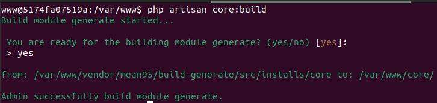
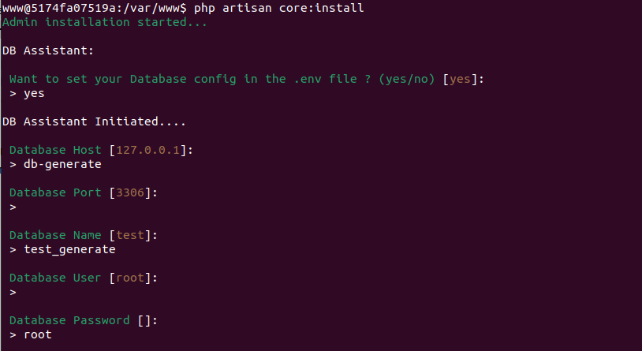
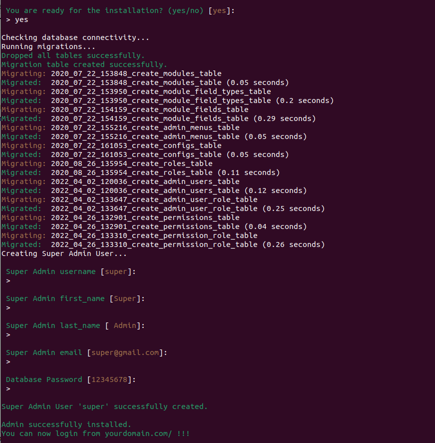

# Laravel generate CRUD for admin
LaraAdmin is a Open source CRM for quick-start Admin based applications with features like Advanced CRUD Generation, Schema Manager and Workflows. <br>

Website: Nothing

Creator: [@mean95](https://github.com/mean95)

### Features:
You can create and edit Modules without touching code. It generate CRUD methods and views on the go from your schema, which can be customized. [Schema based migrations done]

# Contents
- [Installation](#installation)
- [Run command](#run-command)
- [Usage](#usage)
    - [Config composer](#config-composer)
    - [Run command](#run-command)
- [Special Thanks](#special-thanks)
## Installation
1. Add packages to your project <br>
   Add the following code to composer
   ```php
    "repositories": [
        {
            "type": "vcs",
            "url": "https://github.com/mean95/laravel-generate.git",
            "no-api": true
        }
    ]
   ```
   ```php
    "require": {
        "mean95/build-generate": "dev-master"
    }
   ```
2. Run the command
   ```
   composer update
   ```
## Run command
```php
php artisan core:build
```

After running it will give results like the image

_The `core` folder will be created at the source of the project_ <br>
_The `platform` folder will be created in the `public` source folder of the project_ <br>


## Usage
#### Config composer
   Add the following code to composer
   ```php
    "repositories": [
        {
            "type": "path",
            "url": "./core"
        }
    ]
   ```
   ```php
    "require": {
        "mean95/core": "*@dev"
    }
   ```
#### Run the command
```
composer update
```
After updating composer, execute the install command to setup `.env` and run the table with migrate and user super
```angular2html
php artisan core:install
```

_Enter `yes` as shown to perform DB configuration or enter `no` to skip_


_Enter `yes` as shown and follow the instructions to create a table and super admin account._

## Special Thanks
- Le Nghia
- mean.dev95@gmail.com
